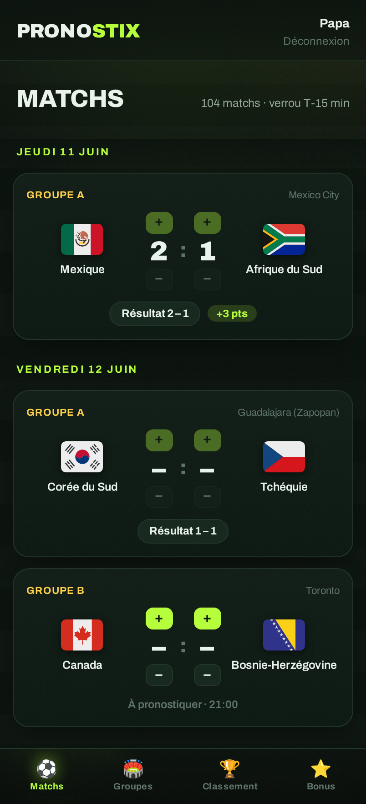
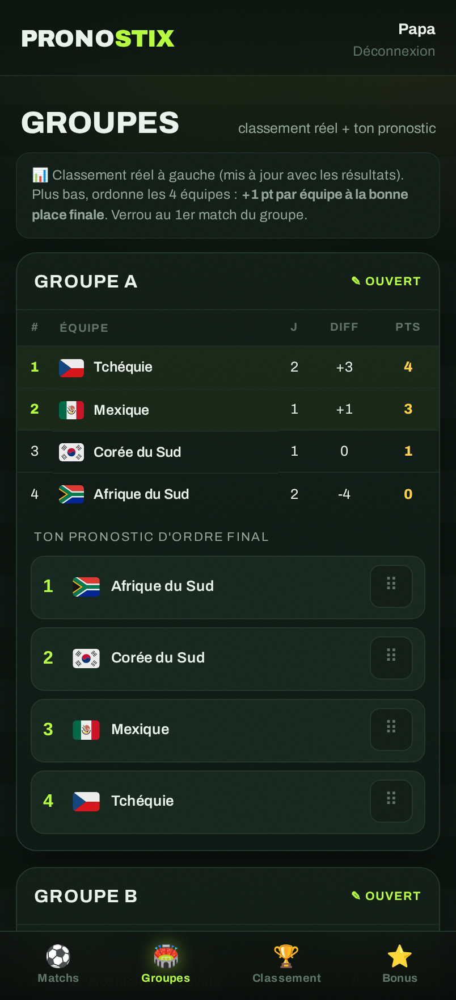
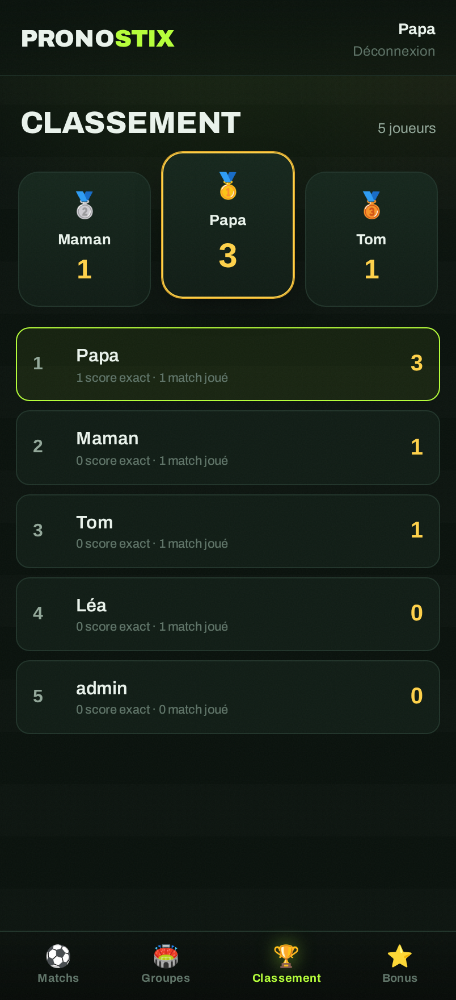

# ⚽ Pronostix — Coupe du Monde 2026 en famille

Application web (mobile-first) de pronostics pour la Coupe du Monde 2026
(USA / Canada / Mexique). Chacun crée un compte en quelques secondes, pronostique
les scores, classe les groupes, place ses bonus — et un classement familial se met
à jour automatiquement. Pensée pour tourner dans **un seul container Docker** sur un NAS.

| Matchs | Groupes | Classement |
|---|---|---|
|  |  |  |

## Fonctionnalités

- **Comptes ultra-simples** : pseudo + code PIN à 4 chiffres, sans email ni vérification.
- **Pronostics de matchs** : score exact pour les 104 matchs (poules + élimination directe).
  - Barème : **3 pts** score exact · **1 pt** bon résultat (1/N/2).
  - Phases finales, bonne équipe qualifiée : **+1 pt** (16es/8es) · **+2 pts** dès les
    quarts (quarts, demies, petite finale) · **+5 pts** pour le bon champion en finale.
  - **Verrou automatique 15 min avant** le coup d'envoi de chaque match.
- **Ordre des groupes** : classe les 4 équipes de chaque groupe → **+1 pt par équipe à la
  bonne place**. Verrou au 1er match du groupe.
- **Bonus** : vainqueur du tournoi + meilleur buteur (**10 pts** chacun), verrouillés au
  coup d'envoi du tournoi.
- **Onglet Groupes** : classements réels en direct (calculés depuis les résultats).
- **Classement familial** avec podium, mis à jour à chaque résultat.
- **Récupération des résultats hybride** :
  - un job interne récupère les résultats finaux (source [openfootball], sans clé) ;
  - un **écran admin** permet de saisir/corriger un score, fixer les équipes des phases
    finales, figer l'ordre officiel d'un groupe, renseigner le vainqueur et **valider le
    pronostic « meilleur buteur » de chaque joueur** (✓/✗, pas de comparaison de texte).

## Stack

- **Backend** : Node 20 + [Fastify] + [better-sqlite3] (un fichier SQLite).
- **Frontend** : SPA en JavaScript natif (aucune étape de build), servie en statique.
- **Drapeaux** : SVG par code ISO (issus de Mission Géo + lipis/flag-icons pour ENG/SCO).
- **Données** : import du calendrier officiel depuis [openfootball/worldcup.json].

## Démarrage avec Docker (recommandé)

```bash
docker compose up -d --build
# → http://<nas>:3000
```

Configuration via `docker-compose.yml` :

| Variable | Rôle | Défaut |
|---|---|---|
| `ADMIN_PSEUDO` | pseudo du compte admin (recréé à chaque boot) | `Matthieu` |
| `ADMIN_PIN` | PIN de l'admin | `2026` |
| `FETCH_INTERVAL_MIN` | fréquence de l'auto-fetch des résultats (0 = off) | `3` |
| `TZ` | fuseau | `Europe/Zurich` |

La base SQLite vit dans le volume `pronostix-data` (`/data`), elle survit aux mises à jour.

> ⚠️ Change `ADMIN_PIN` avant de déployer.

## Développement local

```bash
npm install
npm run setup          # importe les drapeaux puis seed la base
ADMIN_PSEUDO=Matthieu ADMIN_PIN=2026 FETCH_INTERVAL_MIN=0 npm start
# → http://localhost:3000
```

Scripts :

- `npm run flags` — copie/télécharge les 48 drapeaux dans `public/flags/` (one-shot, commité).
- `npm run seed` — importe équipes + 104 matchs (idempotent).
- `npm start` — lance le serveur.

## Mettre à jour les phases finales

Une fois les qualifiés connus : onglet **Admin → Résultats**, « Fixer équipes » sur le
match concerné, puis saisir le score et le qualifié. Pour débloquer les points d'ordre de
groupe : **Admin → Ordre officiel des groupes → Figer**.

## Structure

```
server/        API Fastify, scoring, standings, auth, fetcher, schéma SQLite
  routes/      auth · matches · groups · leaderboard · bonus · admin
  data/        snapshot openfootball + noms FR
scripts/       seed.js · import-flags.js
public/        SPA (index.html, app.js, styles.css) + flags/
```

[Fastify]: https://fastify.dev
[better-sqlite3]: https://github.com/WiseLibs/better-sqlite3
[openfootball]: https://github.com/openfootball/worldcup.json
[openfootball/worldcup.json]: https://github.com/openfootball/worldcup.json
